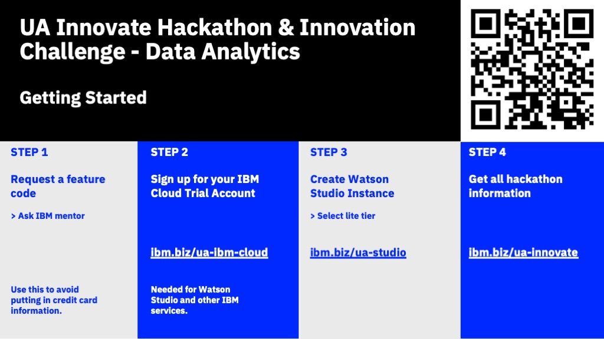

# UA Innovate Hackathon & Innovation Challenge - Data Analytics

## Table of Contents
- [Getting Started](https://github.com/upkarlidder/ua-innovate/blob/main/README.md#getting-started)
- [Events to join during hackathon](https://github.com/upkarlidder/ua-innovate/blob/main/README.md#data-analytics-events)
- [Prompt](https://github.com/upkarlidder/ua-innovate/blob/main/README.md#prompt)
- [Deliverables](https://github.com/upkarlidder/ua-innovate/blob/main/README.md#deliverables)
- [Evaluation](https://github.com/upkarlidder/ua-innovate/blob/main/README.md#evaluation)
- [Support](https://github.com/upkarlidder/ua-innovate/blob/main/README.md#support)

## Getting Started

### Step 1
- Request a feature code
   - **Ask IBM mentor**
- Use this to avoid putting in credit card information

### Step 2
- Sign up for your IBM Cloud Trial Account
- [http://ibm.biz/ua-ibm-cloud](http://ibm.biz/ua-ibm-cloud)
- Needed for Watson Studio and other IBM services.

### Step 3
- Create Watson Studio Instance
    - **Select lite tier**
- [http://ibm.biz/ua-studio](http://ibm.biz/ua-studio)

### Step 4
- Get all hackathon information
- [http://ibm.biz/ua-innovate](http://ibm.biz/ua-innovate)

### Step 5
- [Join the Slack workspace](https://join.slack.com/t/uainnovate/shared_invite/zt-15ubdvavo-3z_3l75B_izK0AunwUJVQw) to stay up to date and for additonal support. 

### Other Resources
- [Build Fast on IBM Cloud](https://github.com/upkarlidder/ibmhacks)
- [Data analysis using Python](https://developer.ibm.com/learningpaths/data-analysis-using-python/)
- [Take control of your data with Watson Studio](https://developer.ibm.com/learningpaths/get-started-watson-studio/)

 

## Data Analytics events

Join us for our workshops & sessions to help you with your solution.
- Prompt Kickoff 11:30 am CST (Saturday) | Learn more about the prompt 
- Workshop 1: Intro to Data Science Tools, 1:00 pm CST (Saturday) | Learn about the data science process & see a demo of Watson Studio
- Workshop 2: Deep dive on Hackathon prompt, 2:30 pm CST (Saturday) | Get the help you need to get started: intro to data analytics, problem statements, registering for IBM Cloud and Watson Studio
- Midpoint Judging, 7:00 pm CST (Saturday) | Get feedback on your solution so far from our mentors
- Final Judging, 10:00 am CST (Sunday) | Present your solution 

## Prompt

### How can we use building energy use data to inform business decisions that can reduce costs for companies returning to the office? 

Use the [provided dataset](https://github.com/upkarlidder/ua-innovate/tree/main/dataset) from Women in Data Science (WiDS) and address the problem statement as either a data analyst OR data scientist as follows:
-	**As a data scientist** create a Machine learning Model that predicts energy efficiency for a building using the data features provide in the training dataset.

- **As a data analyst** create a Jupyter notebook, mobile application, or website that can show a dashboard that answer the  data analysis questions for your manager -see sample questions below and feel free to come up with others (you can answer as many as you are able to):
   - how does energy usage vary from state to state?
   - are there any patterns in the data for energy usage throughout the year?
   - what does energy consumption look like for similar facility types?
   - what type of building is least and most efficient per sq footage?
   - how is energy consumption related to how old the facility is?
   - are newer buildings more energy efficient?
   - can you create a report to summarize the test data set?
      - are there any missing data?
      - how would you handle missing data?
      - are there any outliers?
      - provide statistics around numerical data?
      - do some columns have a large number of categories?

## Deliverables

To submit your entry for the Data Analaytics track, following the directions below (for either data analyst or data scientist).

Submit to Devpost:

**Data Analyst Team**:

One or more of the following for your dashboard (that answers one or more of the given data analysis questions):
- Jupyter notebook with data analytics 
- Website with dashboard that shows data analytics
- Mobile Application with dashboard that shows data analytics

Required:
- Data visualization charts that answer the relevant data analytics questions
- Use of at least one IBM service

**Data Scientist Team**
- Jupyter notebook with machine learning model that predicts energy efficiency
- Optional: Deployed model on IBM Cloud (Using Watson Machine Learning in Watson Studio)

Present in person: 

**Powerpoint presentation:**
-	Team
-	Problem/Question you are answering
-	How you used code to approach the problem:
-	Describe the answer you found
-	Data Analytics charts
-	Demo of solution

## Evaluation

Your solution will be evaluated on both your presentation and technical solution. Specific criteria:
- Solution Completeness
- Documentation
- Technical Depth
- Problem & Solution Description
- Quality of Analysis & Presentation

## Support
Our IBM mentors are here to help you as you work through this data analytics hackathon!
We have both in-person and virtual mentors available to help 
Reach out for help on the #data-analytics channel in the UA Innovate Slack Workspace. Join the workspace [here.](https://join.slack.com/t/uainnovate/shared_invite/zt-15ubdvavo-3z_3l75B_izK0AunwUJVQw) 
